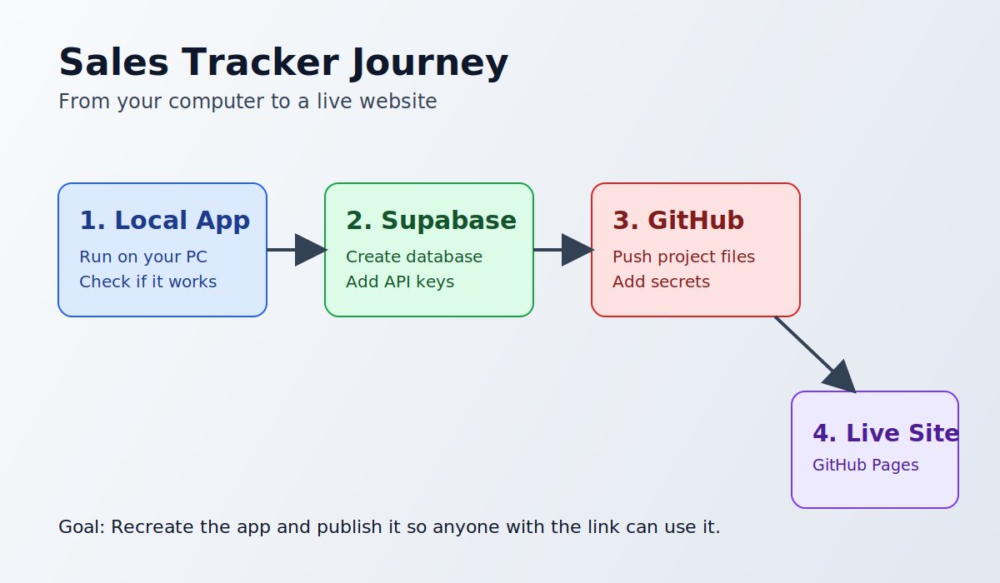
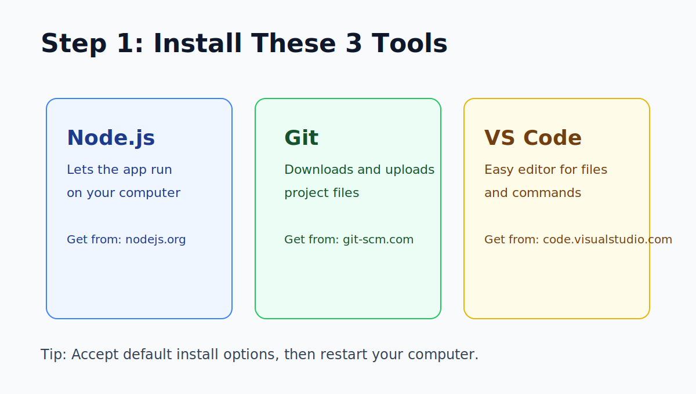
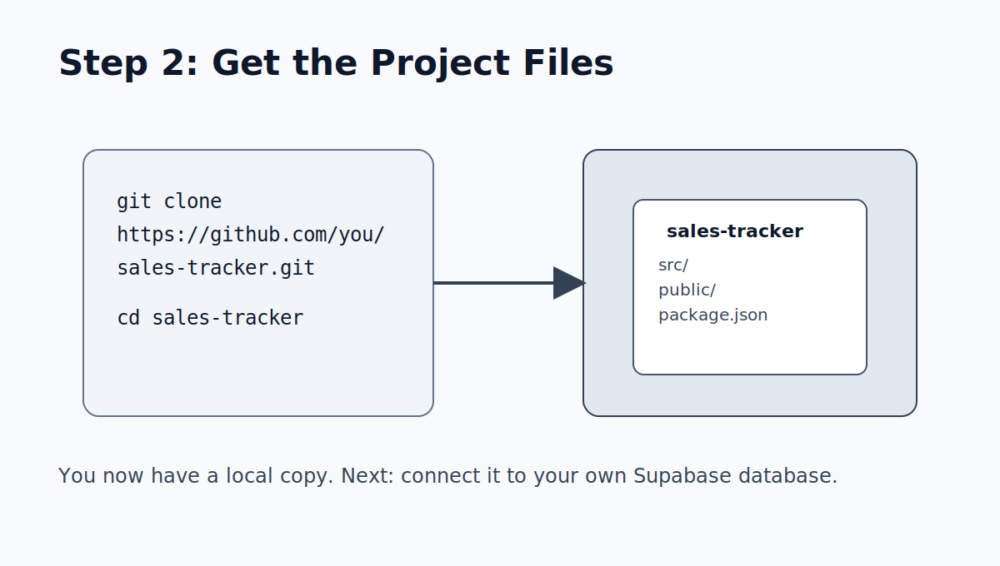
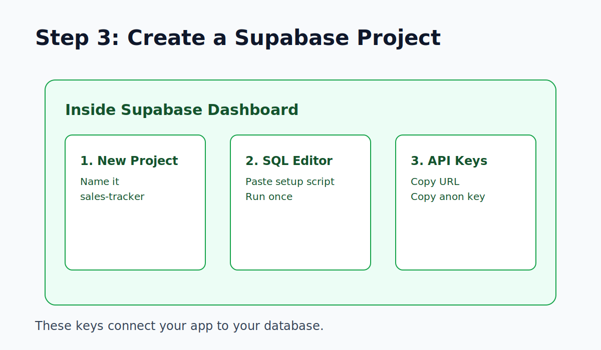
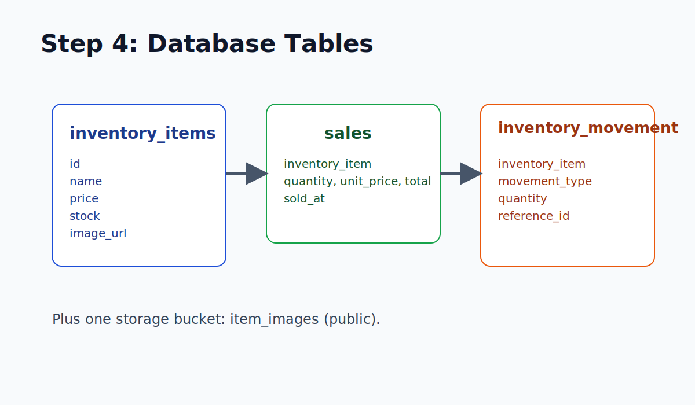
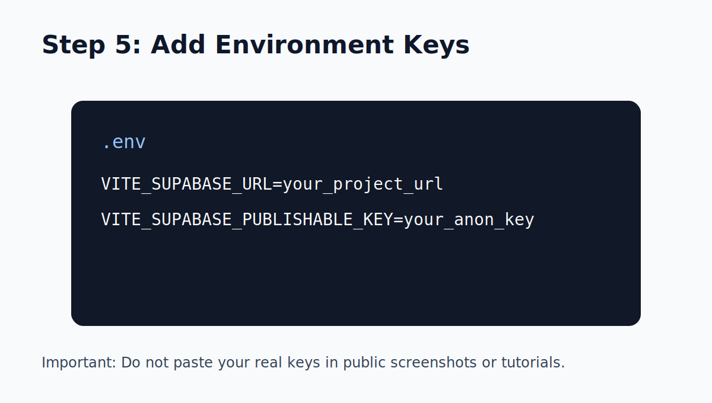
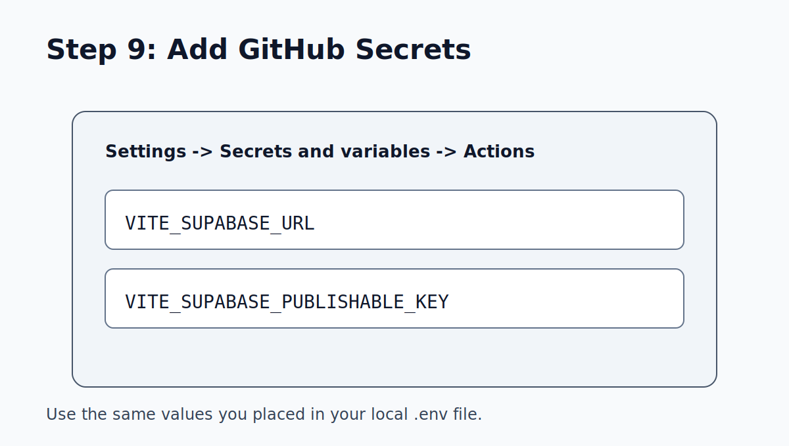
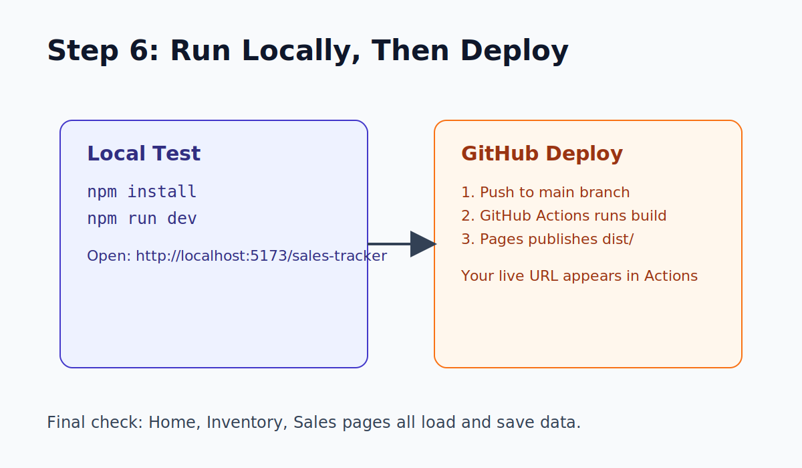
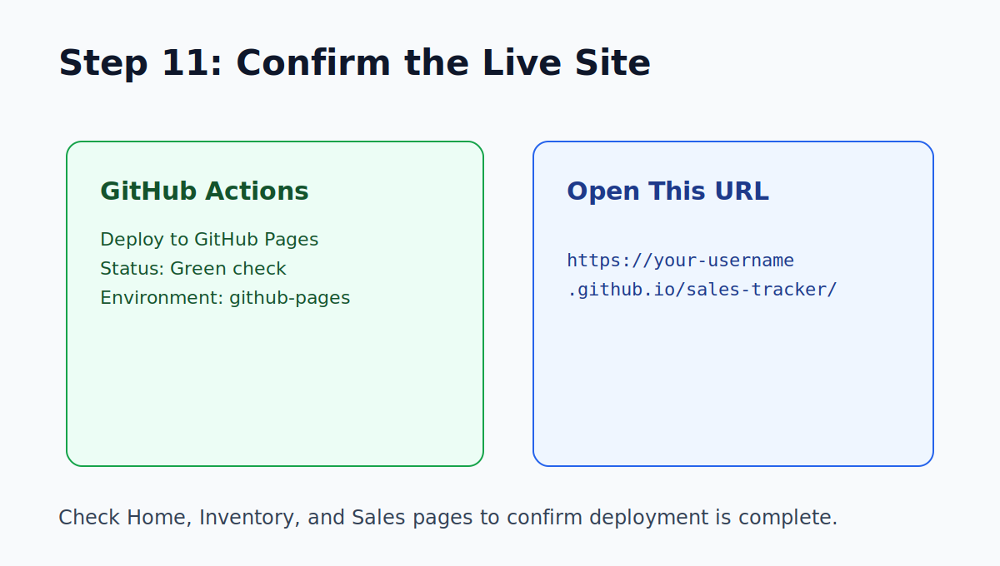

# Sales Tracker: Recreate and Deploy Guide (Beginner Friendly)

This guide helps you recreate this project and publish it online using GitHub Pages.



## What You Need First

- A `GitHub` account (free)
- A `Supabase` account (free)
- A Windows computer with internet

## Step 1: Install the Tools



Install these 3 tools (default options are fine):

1. `Node.js` (LTS version): https://nodejs.org
2. `Git`: https://git-scm.com
3. `Visual Studio Code`: https://code.visualstudio.com

After installing, restart your computer once.

## Step 2: Get the Project Files



If you want to **build the app structure yourself** (instead of cloning), use this alternate guide:

- [Step 2 Alternative: Build the Web App (Broad Overview)](./step-2-build-overview.md)

1. Open VS Code.
2. Open Terminal in VS Code: `Terminal` -> `New Terminal`.
3. Run these commands one by one:

```powershell
git clone https://github.com/<your-username>/sales-tracker.git
cd sales-tracker
```

If you are recreating from a local copy instead of GitHub, just open that folder in VS Code.

## Step 3: Install Project Packages

In the same terminal, run:

```powershell
npm install
```

Wait until it finishes.

## Step 4: Create a Supabase Project



1. Go to https://supabase.com and sign in.
2. Click `New project`.
3. Project name: `sales-tracker`.
4. Set a database password and wait for setup to finish.

## Step 5: Create Tables, Policies, and Storage (Supabase)



1. In Supabase, open `SQL Editor`.
2. Click `New query`.
3. Paste the SQL below.
4. Click `Run` once.

```sql
-- 1) Enum used by inventory_movement
DO $$
BEGIN
  CREATE TYPE movement_type AS ENUM ('SALE', 'RESTOCK');
EXCEPTION
  WHEN duplicate_object THEN NULL;
END $$;

-- 2) Core tables
CREATE TABLE IF NOT EXISTS public.inventory_items (
  id BIGINT GENERATED BY DEFAULT AS IDENTITY PRIMARY KEY,
  created_at TIMESTAMPTZ NOT NULL DEFAULT NOW(),
  name TEXT NOT NULL,
  price NUMERIC(12,2) NOT NULL CHECK (price >= 0),
  stock INTEGER NOT NULL CHECK (stock >= 0),
  image_url TEXT
);

CREATE TABLE IF NOT EXISTS public.sales (
  id BIGINT GENERATED BY DEFAULT AS IDENTITY PRIMARY KEY,
  inventory_item BIGINT NOT NULL REFERENCES public.inventory_items(id) ON DELETE RESTRICT,
  quantity INTEGER NOT NULL CHECK (quantity > 0),
  sold_at TIMESTAMPTZ NOT NULL DEFAULT NOW(),
  unit_price NUMERIC(12,2) NOT NULL CHECK (unit_price >= 0),
  total NUMERIC(12,2) NOT NULL CHECK (total >= 0)
);

CREATE TABLE IF NOT EXISTS public.inventory_movement (
  id BIGINT GENERATED BY DEFAULT AS IDENTITY PRIMARY KEY,
  created_at TIMESTAMPTZ NOT NULL DEFAULT NOW(),
  inventory_item BIGINT NOT NULL REFERENCES public.inventory_items(id) ON DELETE RESTRICT,
  movement_type movement_type NOT NULL,
  quantity INTEGER NOT NULL CHECK (quantity > 0),
  reference_id BIGINT REFERENCES public.sales(id) ON DELETE SET NULL
);

CREATE INDEX IF NOT EXISTS idx_sales_sold_at ON public.sales(sold_at DESC);
CREATE INDEX IF NOT EXISTS idx_inventory_movement_item ON public.inventory_movement(inventory_item);

-- 3) RLS policies (public for demo app without login)
ALTER TABLE public.inventory_items ENABLE ROW LEVEL SECURITY;
ALTER TABLE public.sales ENABLE ROW LEVEL SECURITY;
ALTER TABLE public.inventory_movement ENABLE ROW LEVEL SECURITY;

DROP POLICY IF EXISTS public_all_inventory_items ON public.inventory_items;
CREATE POLICY public_all_inventory_items ON public.inventory_items
  FOR ALL TO public USING (true) WITH CHECK (true);

DROP POLICY IF EXISTS public_all_sales ON public.sales;
CREATE POLICY public_all_sales ON public.sales
  FOR ALL TO public USING (true) WITH CHECK (true);

DROP POLICY IF EXISTS public_all_inventory_movement ON public.inventory_movement;
CREATE POLICY public_all_inventory_movement ON public.inventory_movement
  FOR ALL TO public USING (true) WITH CHECK (true);

-- 4) Public storage bucket for item images
INSERT INTO storage.buckets (id, name, public)
VALUES ('item_images', 'item_images', true)
ON CONFLICT (id) DO UPDATE SET public = true;

DROP POLICY IF EXISTS public_read_item_images ON storage.objects;
CREATE POLICY public_read_item_images ON storage.objects
  FOR SELECT TO public
  USING (bucket_id = 'item_images');

DROP POLICY IF EXISTS public_insert_item_images ON storage.objects;
CREATE POLICY public_insert_item_images ON storage.objects
  FOR INSERT TO public
  WITH CHECK (bucket_id = 'item_images');

DROP POLICY IF EXISTS public_update_item_images ON storage.objects;
CREATE POLICY public_update_item_images ON storage.objects
  FOR UPDATE TO public
  USING (bucket_id = 'item_images')
  WITH CHECK (bucket_id = 'item_images');
```

Important: These policies are intentionally open so the app works without login. Use stricter policies if you add user accounts later.

## Step 6: Connect App to Supabase Keys



1. In Supabase, go to `Project Settings` -> `API`.
2. Copy:
   - `Project URL`
   - `anon public key`
3. In your project folder, create or edit `.env`:

```env
VITE_SUPABASE_URL=your_project_url
VITE_SUPABASE_PUBLISHABLE_KEY=your_anon_key
```

Save the file.

## Step 7: Run the App on Your Computer

In terminal:

```powershell
npm run dev
```

Open this URL in your browser:

```text
http://localhost:5173/sales-tracker
```

Quick test:

1. Go to `Inventory`, add at least 1 item.
2. Go to `Home`, checkout that item.
3. Go to `Sales`, confirm the record appears.

## Step 8: Push to GitHub

1. Create a GitHub repository (name: `sales-tracker`).
2. In terminal, run:

```powershell
git add .
git commit -m "Initial sales tracker setup"
git branch -M main
git remote add origin https://github.com/<your-username>/sales-tracker.git
git push -u origin main
```

## Step 9: Add GitHub Secrets



1. In GitHub repo, open `Settings` -> `Secrets and variables` -> `Actions`.
2. Click `New repository secret` and add:
   - `VITE_SUPABASE_URL`
   - `VITE_SUPABASE_PUBLISHABLE_KEY`
3. Paste the same values from your `.env` file.

## Step 10: Enable GitHub Pages Deployment



This project already includes deployment workflow in `.github/workflows/deploy.yml`.

Now enable Pages:

1. GitHub repo -> `Settings` -> `Pages`.
2. Under `Build and deployment`, choose `Source: GitHub Actions`.

Then push any new commit to `main`. GitHub will build and deploy automatically.

## Step 11: Open Your Live URL



1. Go to GitHub repo -> `Actions` tab.
2. Open the latest `Deploy to GitHub Pages` run.
3. Wait for green check marks.
4. Open the `github-pages` environment link.

Your live link usually looks like:

```text
https://<your-username>.github.io/sales-tracker/
```

## Step 12: If You Changed the Repository Name

If your repo is not named `sales-tracker`, update these values:

1. `vite.config.ts` -> `base: "/your-repo-name/"`
2. `src/App.tsx` -> `basename: "/your-repo-name"`

Then commit and push again.

## Simple Troubleshooting

- Blank page after deploy:
  - Make sure URL has trailing slash and repo name: `/sales-tracker/`
- Build fails in GitHub Actions:
  - Check both repo secrets exist and are not empty
- App loads but cannot save data:
  - Re-run SQL and verify policies were created
- Images do not upload:
  - Confirm `item_images` bucket exists and is public

## Final Checklist

- [ ] App runs locally (`npm run dev`)
- [ ] Supabase tables exist (`inventory_items`, `sales`, `inventory_movement`)
- [ ] Supabase storage bucket exists (`item_images`)
- [ ] GitHub secrets are set
- [ ] GitHub Actions deploy is green
- [ ] Live site opens and can create a sale

You have now recreated and deployed the project.
