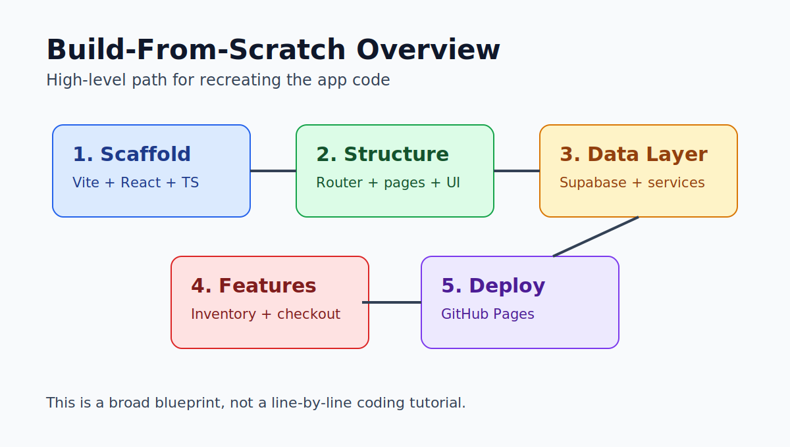
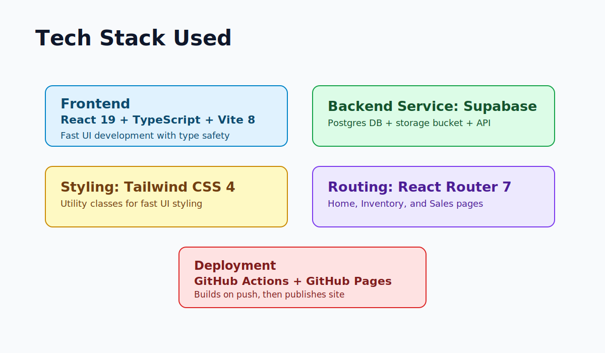
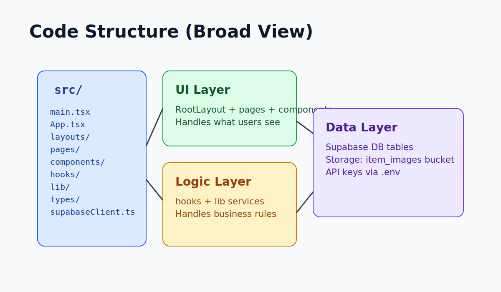

# Step 2 Alternative: Build the Web App (Broad Overview)

Use this if you want to recreate the app structure yourself instead of cloning a ready codebase.



## Goal of This Guide

You will create the app in broad strokes so you understand how the pieces fit together.

This is intentionally not a deep, line-by-line coding tutorial.

## Tech Stack (What Is Used)



- `React 19` + `TypeScript` + `Vite 8`: frontend app
- `React Router 7`: page navigation
- `Tailwind CSS 4`: styling
- `Supabase`: database + storage bucket for images
- `GitHub Actions` + `GitHub Pages`: deployment

## 1) Start a New React + TypeScript Project

In terminal:

```powershell
npm create vite@latest sales-tracker -- --template react-ts
cd sales-tracker
npm install
```

## 2) Install Main App Dependencies

```powershell
npm install react-router @supabase/supabase-js tailwindcss @tailwindcss/postcss postcss
```

## 3) Set Up Styling and Base Structure

- In `src/App.css`, import Tailwind:

```css
@import "tailwindcss";
```

- Keep `src/main.tsx` simple: render `<App />`.
- Add app pages and layout folders:
  - `src/layouts/`
  - `src/pages/`
  - `src/components/`
  - `src/hooks/`
  - `src/lib/`
  - `src/types/`

## 4) Build the Route Skeleton

In `src/App.tsx`:

- Configure router with:
  - `/` -> `Home`
  - `/inventory` -> `Inventory`
  - `/sales` -> `Sales`
- Wrap routes in `RootLayout`.
- Set basename for GitHub Pages path:

```ts
basename: "/sales-tracker"
```

In `vite.config.ts`, set:

```ts
base: "/sales-tracker/"
```

## 5) Create the Main Screens

- `Home`: POS-style item list and cart checkout
- `Inventory`: add items, upload image, adjust stock, search/pagination
- `Sales`: view sales log, date filter, pagination, totals

## 6) Add Supabase Connection

Create `src/supabaseClient.ts` and load from `.env`:

- `VITE_SUPABASE_URL`
- `VITE_SUPABASE_PUBLISHABLE_KEY`

This client is reused across all service files.

## 7) Add Data Service Functions (Business Logic)

Main services live in `src/lib/`:

- `fetchInventoryItems()`
- `createInventoryItem()`
- `removeInventoryItem()`
- `checkoutSale(lines)`
- `adjustInventoryStock(item, nextStock)`
- `uploadInventoryImage(itemId, file)`
- `fetchSalesLog()`

What these do broadly:

- Read/write inventory table
- Record sale entries
- Record movement entries (`SALE` or `RESTOCK`)
- Keep stock values consistent
- Roll back changes if checkout partially fails

## 8) Add Hooks to Connect UI to Services

Main hooks in `src/hooks/`:

- `useInventoryItems()` -> fetch + refetch inventory data
- `useSales()` -> fetch + refetch sales data
- `useCart()` -> local cart state and totals

These keep pages cleaner and move repeated logic out of UI components.

## 9) Wire Components to Pages

Example component split:

- `components/home/`:
  - `PosItemCard`
  - `CartSummary`
- `components/inventory/`:
  - `InventoryTable`
  - `AddInventoryItemForm`
  - `StockModal`
- `components/sales/`:
  - `SalesTable`

## 10) Verify Local App

Run:

```powershell
npm run dev
```

Check this URL:

```text
http://localhost:5173/sales-tracker
```

Test quickly:

1. Add an item in Inventory
2. Checkout in Home
3. Confirm it appears in Sales

## Code Structure Snapshot



## How This Connects to the Main Deployment Guide

After this broad build phase, continue with the main guide starting at:

- **Step 4 (Create a Supabase Project)** in [Recreate and Deploy Guide](./recreate-and-deploy-guide.md)

That guide covers DB SQL setup, secrets, and GitHub Pages deployment.
